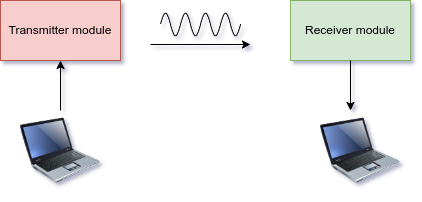

# Optical Transmission Of Text
The purpose of this project was to build a device capable of transmitting text using light.
It consists of two modules:
- Transmitter
- Receiver

The selected encoding for the transmission is Morse Code.
The transmitter encodes the message using Morse Code and emits correspoding light signals using an IR diode.
The receiver has a photodiode working with the same wavelength and an algorithm of decoding, based on
predefined timing constraints defining parameters of Morse Code.

The transmitter is based on Arduino Nano.
The receiver is based on STM32 BlackPill.
